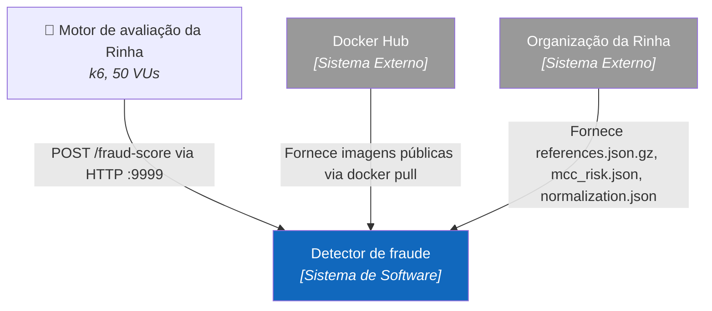
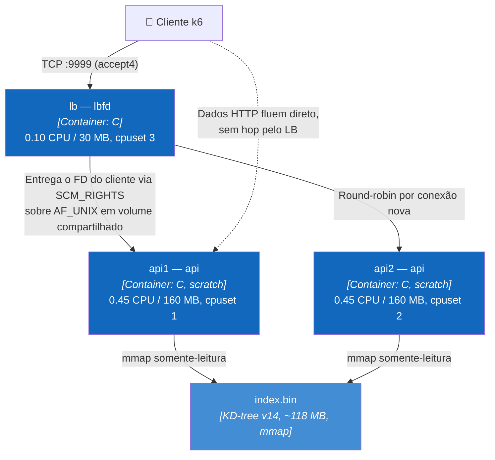

# Rinha de Backend 2026 — Detecção de fraude via busca vetorial

API de detecção de fraude em C que decide transações via 5-NN exato sobre 3M de vetores, sob 1 CPU e 350 MB.

## Sobre

Este repositório é a submissão de Nelson Simionato para a [Rinha de Backend 2026](docs/spec/README.md). O desafio: expor `POST /fraud-score` na porta 9999, transformar cada transação de cartão em um vetor de 14 dimensões, buscar os 5 vizinhos mais próximos em um dataset de referência com 3.000.000 de vetores rotulados e responder `approved` + `fraud_score` — tudo dentro de um orçamento total de **1 CPU e 350 MB** para load balancer + 2 instâncias de API.

A pontuação soma latência (p99 ≤ 1 ms vale +3000) e qualidade de detecção (até +3000). No resultado final oficial, a solução alcançou a **pontuação máxima (6000) e o 4º lugar geral**, com p99 de 0,458 ms e detecção perfeita.

O caminho até aqui está registrado nos ADRs: a primeira implementação em Go (ainda na raiz do repositório) foi substituída por uma reescrita em C com kernels AVX2 escritos em assembly, índice KD-tree exato, quantização int16 e um load balancer próprio que entrega o file descriptor do cliente à API e sai do caminho dos dados.

## Resultado oficial

Resultado final da edição 2026, publicado em [rinhadebackend.com.br](https://rinhadebackend.com.br/):

| Métrica | Valor |
|---|---|
| Posição | **4º lugar** entre 322 submissões pontuadas (406 inscritas) |
| Pontuação | **6000 / 6000** — latência 3000 + detecção 3000 |
| p99 | **0,4581 ms** |
| Detecção | 0 falsos positivos, 0 falsos negativos, 0 erros HTTP em 50.000 requisições |
| Configuração avaliada | commit `dbebe2b` da branch `submission` — imagens `v0.25-lean` (APIs) + `v0.24-lbfd` (LB) |

A configuração final travada (v0.25) evoluiu além do que a `main` documenta (v0.23): acrescenta o loop keep-warm via `epoll_pwait2` com timeout de 60 µs, `TCP_DEFER_ACCEPT` no LB e o layout de cpuset APIs 0/1 + LB "2,3". O código-fonte dessas imagens vive na branch `v0.24-keepwarm`; o processo de promoção está em docs/how-to/sync-submission-branch.md.

## Stack

| Camada | Tecnologia | Versão |
|---|---|---|
| API (runtime da submissão) | C + assembly AVX2, binário estático em imagem `scratch` | gcc (Debian bookworm), `-O3 -mavx2 -march=haswell` |
| Load balancer | C (`lbfd`, passagem de FD via `SCM_RIGHTS`) | — |
| Tooling offline (índice, geradores) | Go | 1.24.4 |
| Implementação legada (histórica) | Go + fasthttp / fastjson | fasthttp v1.71.0, fastjson v1.6.10 |
| Orquestração | Docker Compose | imagens `linux-amd64` |
| Teste de carga | k6 | — |

## Arquitetura

### Contexto (C4 nível 1)



Em runtime o sistema é autocontido: o dataset de referência é pré-processado em build time e embutido nas imagens como `index.bin`. Não há chamadas de rede de saída.

### Containers (C4 nível 2)



O detalhe central: o `lbfd` só participa do **estabelecimento** da conexão. Ele repassa o socket aceito para uma das APIs via `SCM_RIGHTS` e, a partir daí, a API conversa diretamente com o cliente pela vida inteira da conexão keep-alive — zero hops de proxy no caminho dos dados. Detalhes em docs/ARCHITECTURE.md.

Os números do diagrama refletem o compose da `main` (v0.23). A configuração final submetida (branch `submission`, v0.25) mantém a mesma topologia com outro posicionamento: APIs nos cpus 0/1 com 0,49 CPU cada e LB em "2,3" com 0,02 CPU.

### Codemap

```
rinha_2026/
├── c-impl/                  # Solução atual (submissão)
│   ├── src/                 #   API HTTP em C: server (epoll ET), http, json,
│   │                        #   vectorize, search (KD-tree 5-NN), index (mmap),
│   │                        #   response, time_math, distance*.s (AVX2 asm)
│   ├── lb/                  #   Load balancers: lbfd.c (FD-passing, em uso)
│   │                        #   e lb.c (splice proxy, alternativa)
│   ├── tests/               #   Testes unitários (make test)
│   ├── Dockerfile           #   Build estático → imagem scratch
│   └── docker-compose.yml   #   Cluster de desenvolvimento (build local, HAProxy)
├── docker-compose.yml       # Compose da SUBMISSÃO (imagens publicadas, cpuset)
├── main.go, distance_*.go   # Implementação legada em Go (histórica, não implantada)
├── cmd/healthcheck/         # Healthcheck da imagem Go legada
├── haproxy.cfg              # Config HAProxy da stack legada (a atual usa lbfd)
├── info.json                # Inscrição na Rinha (participante, stack, repo)
├── tools/                   # Ferramentas offline em Go: build_kdtree (gera o
│                            # index.bin), mccgen, synth_refs, inspect_bin,
│                            # build_partition_hash (referência histórica)
├── resources/               # Dataset e artefatos: references.json.gz (não
│                            # versionado), index.bin (gerado), mcc_risk.json,
│                            # normalization.json, example-payloads.json
├── k6/                      # Cenário de teste de carga local
├── docs/
│   ├── spec/                # Especificação oficial do desafio (intocada)
│   ├── adr/                 # Decisões de arquitetura
│   └── ARCHITECTURE.md      # Arquitetura desta solução
├── TUNING.md                # Playbook de tuning (parâmetro → métrica → custo)
├── AUDIT_FINDINGS.md        # Histórico: auditoria da implementação Go
├── IMPLEMENTATION_PLAN.md   # Histórico: plano que originou a solução atual
└── participants/            # JSON de inscrição na Rinha
```

## Especificações

### Modelo de domínio

| Conceito | Descrição |
|---|---|
| Transação | Payload JSON de `POST /fraud-score`: `transaction`, `customer`, `merchant`, `terminal`, `last_transaction` |
| Vetor de consulta | 14 dimensões normalizadas (fórmulas em docs/spec/DETECTION_RULES.md), quantizadas para int16 escala 10000; `last_transaction` nula vira sentinela −10000 |
| Registro de referência | Um dos 3M vetores rotulados `fraud`/`legit` de `references.json.gz` |
| Índice | KD-tree balanceada (formato v14), folhas de 32 registros com AABB por nó; gerada offline por `tools/build_kdtree.go` |
| Decisão | `fraud_score = frauds_entre_os_5 / 5`; `approved = fraud_score < 0.6` |

### Integrações externas

Nenhuma em runtime. Em build/deploy: Docker Hub (imagens `nelsonsimionato/rinha-backend-2026`) e os arquivos de referência fornecidos pela organização da Rinha.

### Requisitos não-funcionais

| Requisito | Valor | Origem |
|---|---|---|
| Orçamento total de recursos | 1 CPU, 350 MB, rede `bridge` | Regra do desafio (docs/spec/ARCHITECTURE.md) |
| Porta pública | 9999 | Regra do desafio |
| Latência alvo | p99 ≤ 1 ms satura a pontuação (+3000); > 2000 ms fixa −3000 | docs/spec/EVALUATION.md |
| Detecção | 5-NN exato por construção; erro residual limitado à quantização int16 | docs/adr/0004 |
| Ambiente oficial de teste | Mac Mini Late 2014, 2,6 GHz, 8 GB RAM, Ubuntu 24.04 | docs/spec/README.md |

## Documentação

- Instalação e primeiros passos → [GETTING_STARTED.md](GETTING_STARTED.md)
- Arquitetura da solução → [docs/ARCHITECTURE.md](docs/ARCHITECTURE.md)
- Decisões de arquitetura → [docs/adr/](docs/adr/)
- Como atualizar a branch de submissão → [docs/how-to/sync-submission-branch.md](docs/how-to/sync-submission-branch.md)
- Playbook de tuning → [TUNING.md](TUNING.md)
- Especificação oficial do desafio → [docs/spec/](docs/spec/README.md)
- Histórico (implementação Go): [AUDIT_FINDINGS.md](AUDIT_FINDINGS.md), [IMPLEMENTATION_PLAN.md](IMPLEMENTATION_PLAN.md)

## Licença

[MIT](LICENSE) © 2026 Nelson Simionato Inácio
